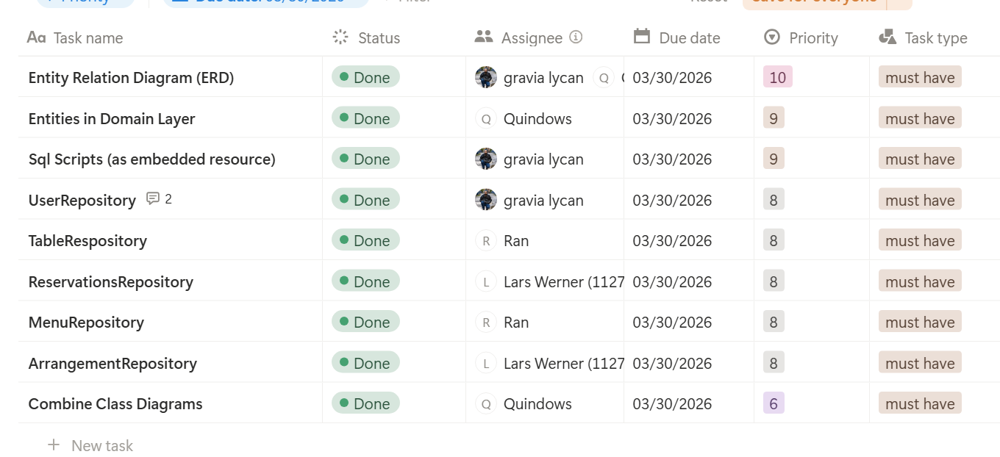
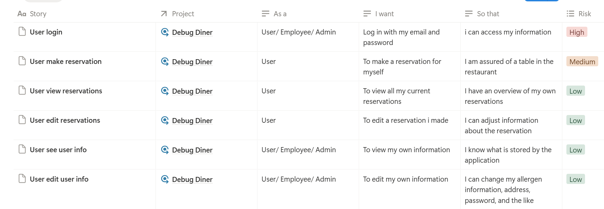
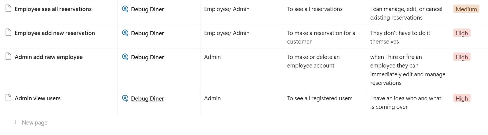

# Document Individuele Bijdrage

| | |
|---|---|
| **Naam** | Soufian Manai |
| **Studentnummer** | 1114385 |
| **Opleiding** | HBO-ICT |
| **Vak** | Software Development — INF11 |
| **Project** | Debug Diner — Console Reserveringssysteem |
| **Datum** | Juni 2026 |

---

## Scrum Master — Sprint 3

### Reflectie op jouw rol als scrum master

Met name hebben wij als team een Sprint planning, en weekly-standup gehouden. Hierin zijn de besproken dingen redelijk een standaard en vanzelfsprekende routine voor mij.
Het effect hiervan is dat ik niet altijd even goed door heb dat niet iedereen even snel mee komt. Hier is ook feedback voor gegeven.

### Feedback

Mijn medestudenten geven aan dat ik soms te snel ga als PSM, waardoor ze soms niet helemaal bij kunnen houden waar ik het nou over heb.
Hier ga ik in de toekomst meer op letten en ervoor zorgen dat er supplemental materiaal beschikbaar is zodat ze hier nog op terug kunnen vallen.

### Screenshot Sprint backlog

### Samenvatting review

Hier hebben wij het niet over gehad met de PO, dus veel feedback is er niet over gekomen. Hier hadden we eerder met de PO over moeten zitten.

### Samenvatting retrospective

Door de manier waarop dit team werkt en samen werkt, is er niet veel "Retrospective" geweest. Dit team heeft tijdens sprintplannings en wekelijkse meetings op discord aan gegeven wat er mis ging en hoe dit te verbeteren.
Zo zijn we eigelijk wekelijks samen aan het groeien geweest zonder dat hier noodzakelijke afspraken voor nodig waren.
Een mooi voorbeeld is geweest dat een van ons niet altijd de code testte voor oplevering via een PR, hierdoor ontstonden er codebase issues, merge conflicts, en programma crashes.
Tijdens de wekelijkse meeting is er gevraagd aan de medestudent om hier meer op te letten met de vraag erbij of wij konden bijstaan op een manier zodat we dit konden voorkomen.
Hierna is er geen zulk probleem meer ontstaan.

Deze zelfde manier is gebruikt met niet alleen problematiek, maar ook met de nodige complimenten en dingen die als "Tof" ervaren werden.
Hoog moraal, en een ongesproken vloeiende samenwerking heeft voor ons--wel onbewust--de retrospective uit beeld gelaten.

### Reflectie op retrospective

Door de hierboven genoemde structuur is dit niet in te vullen.

## Logboek

## Sprint 0 (Voorbereiding)

| Beschrijving taken                                          | User Story (indien van toepassing) | Tijdsindicatie |
|-------------------------------------------------------------| --- |----------------|
| Opbouwen strategische architectuur met diagrammen en uitleg | | 12u            |
|                                                             | **Totaal:** | 12u            |

### Beschrijving en reflectie sprint 0 (voorbereiding)

**Mijn bijdrage**

Op basis van de 3 cases die ons voorgelegd waren hebben we gezamelijk gekozen voor het restaurant. Ik gaf aan hiervoor een architectuur op te willen bouwen, welke ik daarna bedacht had en een diagram voor gemaakt had.
Dit diagram heb ik naar de rest van mijn medestudenten gestuurd voor review. In plaats van acceptatie is mij om een uitleg gevraagd, waarvoor ik de tijd heb genomen uit te leggen wat elke laag van de applicatie moet doen, en waarom ik voor deze structuur gekozen had.
Vanuit daar zijn we op basis van deze structuur ERD's en andere diagrammen gaan maken.

**Reflectie op mijn bijdrage**

Wellicht had ik niet gelijk een complexiteit voor dit team moeten opbouwen zoals ik deze op heb gebouwd, zeker gezien er gaandeweg nog sommigen achter zijn gebleven
Aan de andere kant heeft dit wel gezorgd voor een bepaalde structuur die we niet hadden gehad als we ad-hoc gestart zouden zijn.
Daarom denk ik zelf dat het een grote impact heeft gehad, in positieve zin, om met een architectuur te beginnen, en daarbij wel een stukje complexiteit te geven tegenover een meer gestructureerde ontwikkeling van de applicatie.

---
## Sprint 1

| Beschrijving taken | User Story (indien van toepassing) | Tijdsindicatie |
| --- | --- | --- |
| Initiële repository opzet + basis bestanden |  | 4.0 uur |
| PO Interview voorbereiden en uitvoeren | User login, User make reservation | 0.5 uur |
| Architectuur ontwerpen (mermaid diagrammen) | Architectural Design | 4.0 uur |
| User stories uitschrijven na PO interview | Write User-Stories | 0.5 uur |
| Sprint planning + taakverdeling |  | 4.0 uur |
| | **Totaal:** | |

### Beschrijving en reflectie sprint 1

**Mijn bijdrage**

In dit stuk van de ontwikkeling heb ik de architectuur opgezet zoals mij dit ooit geleerd is, zodat we vanuit daar konden beginnen.
Dit bestaat uit de Dependency Injection layer, abstracties (interfaces en base-classes), en generic-database classes
Daarnaast heb ik besloten logging bij te houden wat het debuggen later makkelijk zou maken. Voor logging hebben we Serilog gebruikt omdat deze library het meest uitgebreid is.

**Reflectie op mijn bijdrage**

Gezien het team het makkelijker had hierin te werken zodra ze de structuur door hadden, leek het mij wel een structuur die werkt. In elk geval voor dit team.
Vanuit daar zijn er wel een aantal punten die een volgend project duidelijker en overzichtelijker maken.
Updaten en aanpassen logica is dan wel weer heel fijn gegaan omdat je met deze structuur alleen dat stukje waar de bug in te vinden was hoeft aan te passen, en de rest van de applicatie door kan gaan.
Een voorbeeld hiervan is de database laag.
Als in de database niet de juiste data word gebruikt om uit de database te zoeken naar een gebruiker of menu item, hoeft alleen de functie logica aangepast te worden.
de rest van de applicatie stopt nog steeds dezelfde parameters in de functie, en verwacht nog steeds dezelfde data terug. Als dit onveranderd blijft, hoeft je dus nergens anders aanpassingen te doen!

---
## Sprint 2

| Beschrijving taken | User Story (indien van toepassing) | Tijdsindicatie |
| --- | --- | --- |
| ERD gemaakt voor het project | Entity Relation Diagram (ERD) | 1.0 uur |
| SQL scripts aanmaken en toevoegen aan project | Sql Scripts (as embedded resource) | 3.0 uur |
| UserRepository.cs implementeren | UserRepository | 1.5 uur |
| Unit tests schrijven en unificatie database implementaties | Add developer tests | 2.0 uur |
| Sprint meetings (23/03 + 30/03) |  | 2.0 uur |
| | **Totaal:** | |

### Beschrijving en reflectie sprint 2

**Mijn bijdrage**

Nadat de structuur opgebouwd is, verwacht de applicatie "embedded resources". Dit houd in dat de applicatie bestanden verwacht die ingebakken zijn in de applicatie
welke gebruikt kunnen worden--in dit geval--om de database te initialiseren. Hiervoor waren SQL bestanden nodig die de tables aanmaakt, en welke gebaseerd zijn op de ERD diagrammen.
De ERD is in de documentatie onder `/Team/3- APPLICATION/ERD_Entity Relationship Diagram/ERD-Debug-Diner.png` te vinden.

**Reflectie op mijn bijdrage**

Wat mij stoorde was dat ik in deze sprint compleet vergeten was de Unit Tests te bouwen wanneer alles nog vers was, later heb ik hier met terugwerkende kracht op terug moeten komen om deze unit tests alsnog te schrijven.
Dit zorgde er wel voor dat ik de code opnieuw moest lezen, bedenken wat ik die aantal weken geleden van plan was hiermee, en vanuit daar de unit tests schrijven.
Nu is dat zelf niet zo'n groot probleem of een grote taak om te doen, maar het had me wel veel makkelijker geweest als ik dit gelijk had gedaan.
In het vervolg schrijf ik de Unit Tests tegelijk met de code waar ik op dat moment mee bezig ben.

---
## Sprint 3

| Beschrijving taken | User Story (indien van toepassing) | Tijdsindicatie |
| --- | --- | --- |
| Werkende applicatie basis opzetten (navigatie, eerste schermen) | Views | 4.0 uur |
| Admin registratie updaten | Admin View | 1.0 uur |
| PR's reviewen en mergen (SM-rol) |  | 2.0 uur |
| Sprint planning faciliteren |  | 1.0 uur |
| | **Totaal:** | |

### Beschrijving en reflectie sprint 3

**Mijn bijdrage**

In plaats van de basis views en navigatie opbouwen, ben ik me gaan focussen op Quintin helpen met de views wat in dit geval vooral bestond uit de PR's controleren, testen, en advies geven waar er advies gevraagd werd.
Daarnaast ben ik een navigatie service gaan bouwen om later samen te werken met de views. De bedoeling is dat elke view dan alleen de "volgende" view hoeft mee te gegven aan de navigatie service.
De navigatie service zorgt er dan voor dat er een 'previous' view beschikbaar is, een 'current' view, en uiteindelijk de navigatie items die bij die view horen, beschikbaar zijn en initialized worden.

**Reflectie op mijn bijdrage**

De complexiteit van de navigatie was iets veel voor wat we er uiteindelijk mee wilden doen, al hielp het wel met abstracties opbouwen en het gebruik van static values in de applicatie te leren gebruiken.
Voor mij is er weinig leer process geweest tot zo ver in de sprint, maar het was erg prettig om het team uit te leggen hoe en wat, waardoor ik zelf ook wel een dieper begrip krijg van het process en de code.

---
## Sprint 4

| Beschrijving taken | User Story (indien van toepassing) | Tijdsindicatie |
| --- | --- | --- |
| MakeReservation bugfixes | Make Reservation View | 2.0 uur |
| Navigatie registry uitbreiden | Views | 1.5 uur |
| PR's reviewen (SM-rol afgerond) |  | 1.0 uur |
| | **Totaal:** | |

### Beschrijving en reflectie sprint 4

**Mijn bijdrage**

De navigatie service was opgebouwd, en deze moet aangevuld worden met de juiste navigatie linkjes per view. Hiervoor zijn we qua structuur
diep in overleg geweest, willen we het in de views definieren of willen we het door de service laten doen, en als we dit door de service willen laten doen,
willen we dan constants opbouwen, of dynamisch laten doen.
Uiteindelijk hebben we gekozen voor een semi-constants manier van opbouwen die elk zijn eigen "Navigate" functie heeft ingebouwd.

**Reflectie op mijn bijdrage**

Deze hele sprint zat vol met complexiteit die maar half nodig was, of toch niet, misschien toch wel... Dit soort gesprekken.
Aan de ene kant was het frustrerend omdat je niet het idee hebt dat je heel ver komt in zo'n sprint, maar aan de andere kant helpen dit soort
sprints het team wel beter samen te werken. Omdat elk gesprek betekend dat je even de tijd moet nemen om te luisteren naar de teamgenoten hun standpunt, technische ideeen, en mogelijke moeilijkheden.
Doordat we dit soort dialoog meermaals gestart zijn in deze sprint, is dit in het vervolg net iets makkelijker
omdat je de limitaties en krachten van het team leert kennen.

---
## Sprint 5

| Beschrijving taken | User Story (indien van toepassing) | Tijdsindicatie |
| --- | --- | --- |
| Logging toegevoegd op application level | Application Services | 2.0 uur |
| Culture Info enforcement (datum/getal notatie) | Per-View Bugfixing | 1.5 uur |
| Navigatie updates en bugfixes | Views | 2.0 uur |
| Merge fixes |  | 1.0 uur |
| | **Totaal:** | |

### Beschrijving en reflectie sprint 5

**Mijn bijdrage**

Logging bestond grotendeels al in de applicatie, maar niet elke laag van de applicatie is nuttige informatie aan het loggen geweest, of heeft geen informatie gedeeld naar de log bestanden.
Hier ben ik goed voor gaan zitten om door de hele applicatie.
Naast het opbouwen van de logging, waren er een aantal bugs in de applicatie die de anderen niet konden achterhalen.
Hier ben ik me over gaan druk maken, en ben ik op bug-hunt gegaan in deze sprint.

**Reflectie op mijn bijdrage**

Bugs zoeken is niet iets waar ik plezier uit haal, maar het moet gebeuren. Doordat ik iets meer ervaren ben in programmeren
was het voor mij makkelijker en konden de anderen zich focussen op de rest van de applicatie.
Wat wel fijn is voor mij, als ik me dan bezig houd met documentatie, bugs, logging, en dat soort taken die ik zelf
als "minder" zie, is dat mijn kennis van de applicatie wel up to date blijft ondanks bezig te zijn met andere taken.

---
## Sprint 6

| Beschrijving taken | User Story (indien van toepassing) | Tijdsindicatie |
| --- | --- | --- |
| Code consistency pass | Per-View Bugfixing | 2.0 uur |
| Navigation smart-stack implementatie | Views | 2.0 uur |
| Quick fixes na feedback |  | 1.0 uur |
| | **Totaal:** | |

### Beschrijving en reflectie sprint 6

**Mijn bijdrage**

Met werken in een team is er altijd één ding die over blijft. Iedereen schrijft met een eigen stijl.
Omdat wel wel coding standaarden besloten hebben aan het begin, en deze geprobeerd hebben te handhaven middels een .editorconfig bestand
zijn er altijd nog een aantal dingen die handmatig gestroomlijnd moeten worden.
Deze sprint waren we al zo goed als klaar met de applicatie, en heb ik me op de standaarden en saamhorigheid van stijl gezet.
Dit zorgt er uiteindelijk voor dat de functionaliteit niet aangepast word, maar kleine schrijf en structuur stijlen hetzelfde blijven in de codebase.

**Reflectie op mijn bijdrage**

Ook deze sprint voor mij leek weinig nuttig voor mij, maar het team heeft mijn persoonlijke situatie heel fijn opgepakt.
Ik zat de laatste twee sprints niet helemaal lekker met mijn werk situatie en andere persoonlijke moeilijkheden waardoor ik maar half werk kon leveren.
Door toch een bijdrage te kunnen leveren--zoals dus coding standards en stijl--heeft het team mij heel fijn ondervangen.

---

