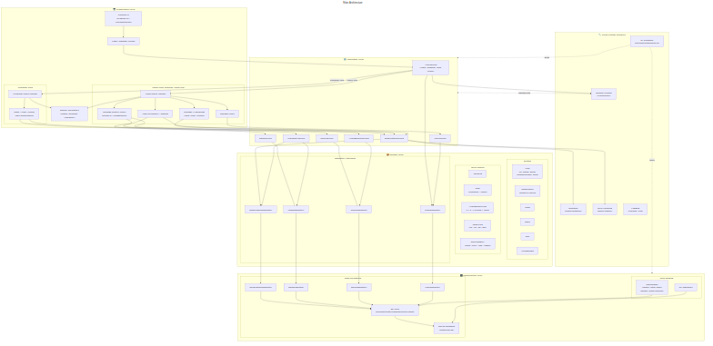
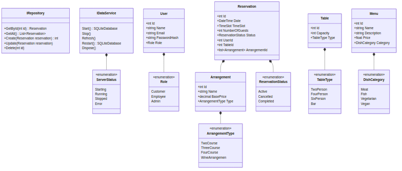
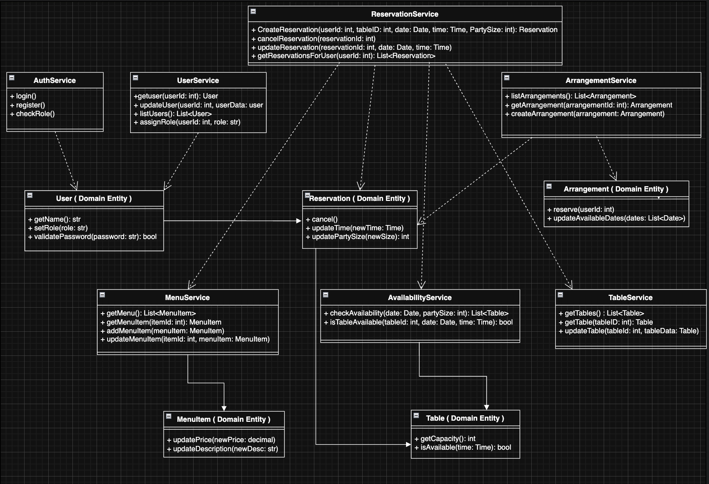
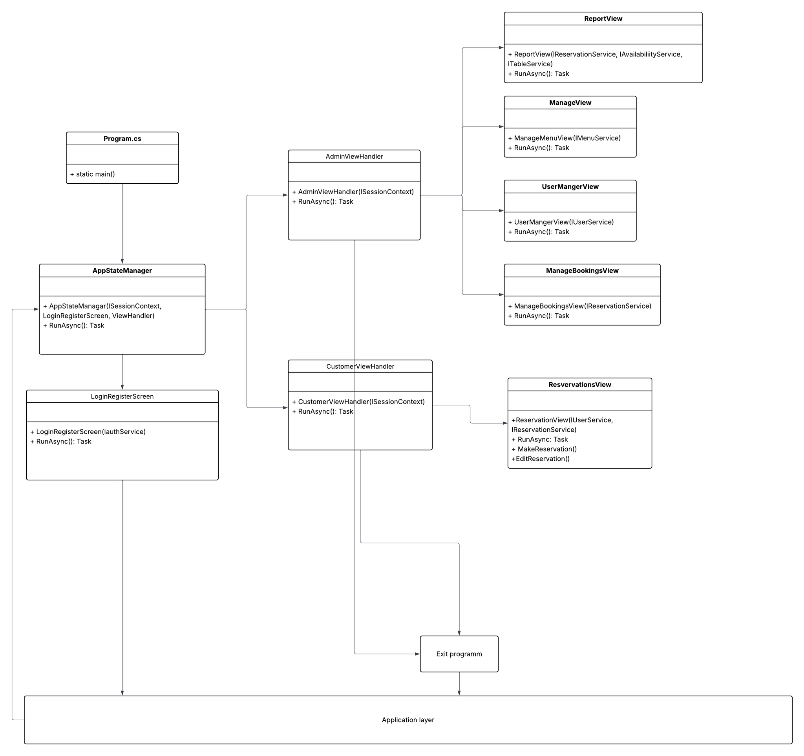
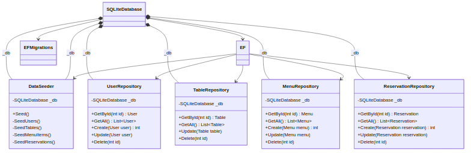

# Architecture

The Presentation layer depends only on the application layer, which allows for the application-layer to handle all the interactions and pass through what needs to happen to the presentation layer.

The Application-Layer only depends on the Domain layer, allowing orchestration to happen between application and the services.

The Domain layer has no dependencies on its own, allowing others to depend on the domain

The Infrastructure layer depends on the interfaces from the Domain layer, implementing the methods. This creates a barrier between the services and the presentation.

[Cross-Cutting Concerns](Architecture/Cross-Cutting Concerns.md)

