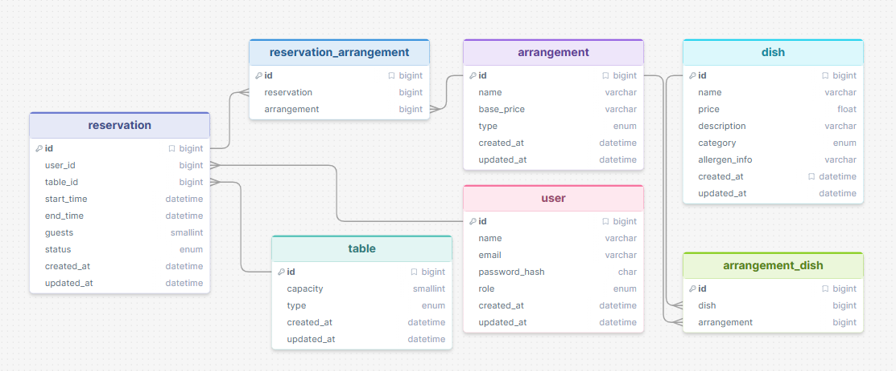

# Entity Relationship Diagram - Debug Diner

Zie `ERD - Debug Diner.png` voor het visuele diagram.
Onze ERD is gemaakt met de DrawSQL app online, een screenshot hiervan:

## Entiteiten

| Entiteit | Tabel | Omschrijving |
|---|---|---|
| UserEntity | `user` | Klanten, medewerkers en admins |
| ReservationEntity | `reservation` | Restaurantreserveringen |
| TableEntity | `table` | Restauranttafels |
| ArrangementEntity | `arrangements` | Diner-arrangementen |
| DishEntity | `dish` | Menugerechten |
| ReservationArrangement | `reservation_arrangement` | Koppeltabel reservering↔arrangement |

## Relaties

- Een **User** kan meerdere **Reservations** plaatsen (1:N)
- Een **Table** kan in meerdere **Reservations** voorkomen (1:N, op verschillende tijden)
- Een **Reservation** kan meerdere **Arrangements** bevatten via koppeltabel (M:N)
- Een **Arrangement** kan aan meerdere **Reservations** gekoppeld zijn (M:N)
